# Original Plan Reference (In-Repo)

This document mirrors the original implementation plan in the repository so it can be maintained over time.

## Plan Metadata

- **Name:** Sonarr/Radarr data strategy
- **Overview:** Docker Compose app + PostgreSQL (`app` + `warehouse` schemas), full/incremental/webhook sync modes, warehouse views for dashboards, and reliability hardening.

## Plan Todo Ledger

Status values below are mirrored from the original plan tracking.

| ID | Status | Scope |
| --- | --- | --- |
| `docker-compose` | completed | default `postgres` + `app` |
| `postgres-schemas` | completed | Alembic schemas/tables + app grants |
| `warehouse-views` | completed | stable analytics views in `warehouse` |
| `full-sync-sonarr` | completed | first/forced Sonarr full sync (series + episodes/files) |
| `full-sync-radarr` | completed | first/forced Radarr full sync (movies/files) |
| `incremental-reconcile` | completed | history polling + reconcile flow |
| `webhooks` | completed | authenticated webhook ingress + queue + targeted fetches |
| `scheduler-ui` | completed | schedule CRUD + manual run actions |
| `webui` | completed | modern multi-view operations UI |
| `metrics-health` | completed | `/metrics`, health, run summary capture |
| `reporting-docs` | completed | reporting and dashboard docs |
| `nfr-secrets` | completed | env/secrets preference + no secret logging + docs |
| `nfr-instance-scope` | completed | v1 multi-instance model |
| `nfr-idempotency` | completed | idempotent upserts + dedupe-safe overlap |
| `nfr-arr-version` | completed | record/show Arr version |
| `nfr-rate-limits` | completed | conservative API concurrency/retry controls |
| `nfr-time-canonical` | completed | UTC/time semantics docs |
| `docs-backup-restore` | completed | backup/restore and credential rotation docs |
| `nfr-observability` | completed | structured logs + request correlation |
| `compose-resource-hints` | completed | CPU/memory recommendations |
| `tests-contract-smoke` | completed | contract tests + optional CI smoke |
| `job-locking` | completed | single-flight lock semantics |
| `data-retention-pruning` | completed | retention and pruning policy |
| `dead-letter-retry-policy` | completed | retry/backoff + dead-letter handling |
| `perf-indexing-plan` | completed | indexing/materialization strategy doc |
| `config-validation` | completed | startup/UI config validation |
| `docs-operations-runbook` | completed | operator runbook |
| `migration-safety-rollforward` | completed | expand/contract, roll-forward guidance |
| `api-capability-detection` | completed | startup API capability probing |
| `alerting-slos` | completed | thresholds + health-state model |
| `data-lineage-audit-columns` | completed | lineage fields in warehouse rows |
| `graceful-shutdown` | completed | signal handling + lock release/drain behavior |
| `http-timeouts-retries` | completed | bounded timeout/retry policy |
| `media-deletes-tombstones` | completed | delete/tombstone propagation |
| `ci-quality-gates` | completed | lint/type/test gates |
| `bootstrap-db-roles` | completed | fresh DB roles/schemas/grants bootstrap |
| `advisory-lock-lease-strategy` | completed | lock model and crash recovery |
| `webhook-http-hardening` | completed | body/auth/parse hardening |
| `postgres-engine-pooling` | completed | pool + timeout guidance |
| `docs-readme-quickstart` | completed | root quickstart flow |
| `build-metadata-health` | completed | version/SHA in status/health surfaces |
| `scheduler-timezone` | completed | scheduler timezone semantics doc |

## Core Plan Summary

- Ingestion path is Sonarr/Radarr REST APIs only.
- PostgreSQL is the only database runtime dependency.
- `warehouse` schema is analytics-facing; `app` schema is operational state.
- Default stack is `app + postgres`.
- Full sync initializes data; incremental polling + webhooks maintain deltas.
- Warehouse views provide stable contracts for reporting queries.

## Architecture Drawings (Consolidated)

The following section consolidates architecture drawings from the original plan and architecture docs.

### Runtime And Trust Boundaries

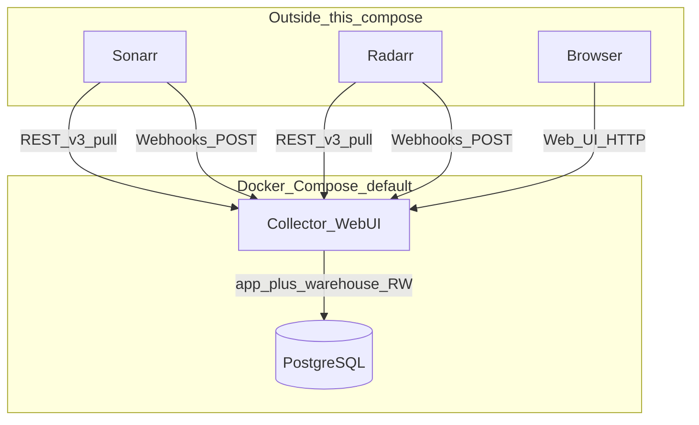

### PostgreSQL Schema Access Model

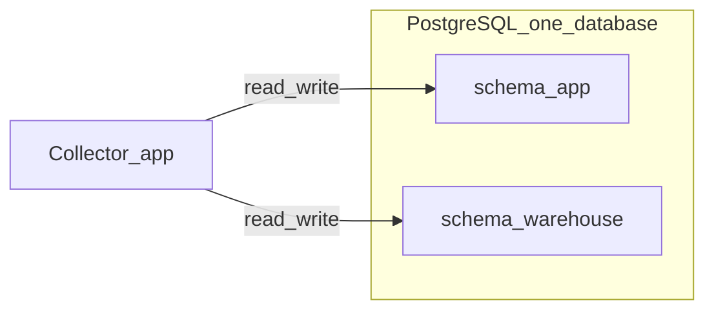

### Sync Lifecycle State Machine

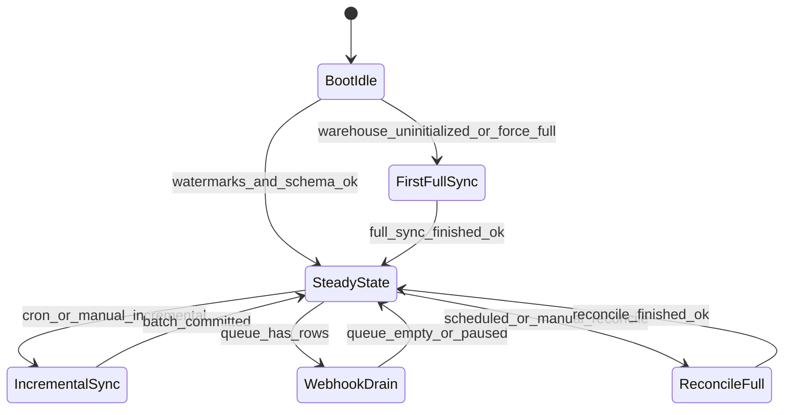

### Webhook Handling Sequence

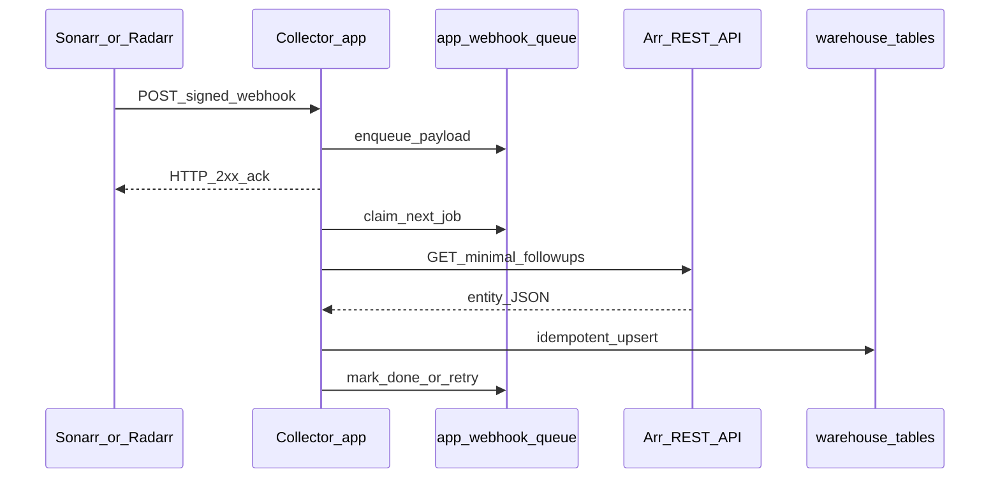

### Job Locking Coordination

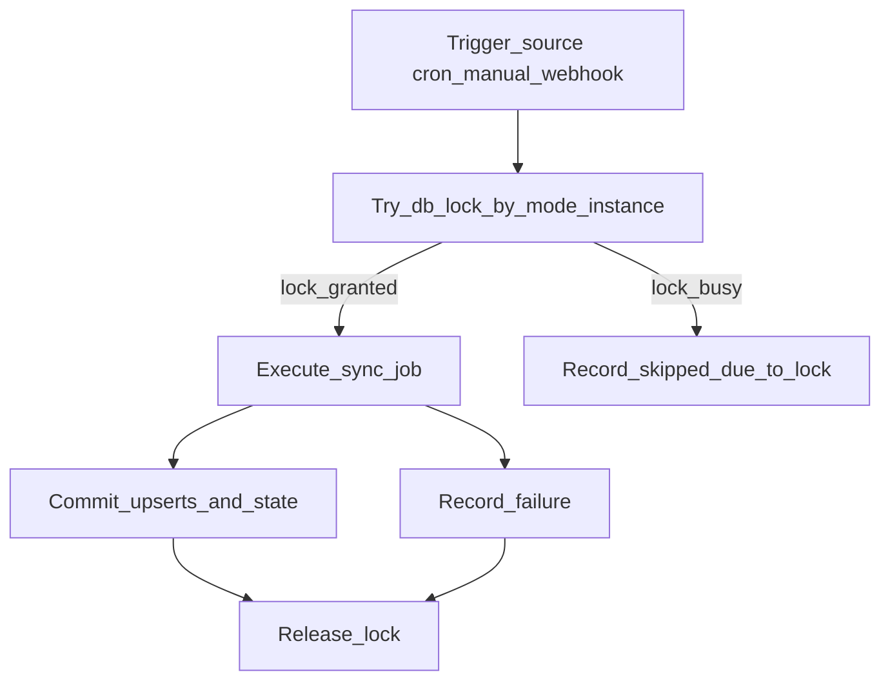

### Error Handling And Dead-Letter Lifecycle

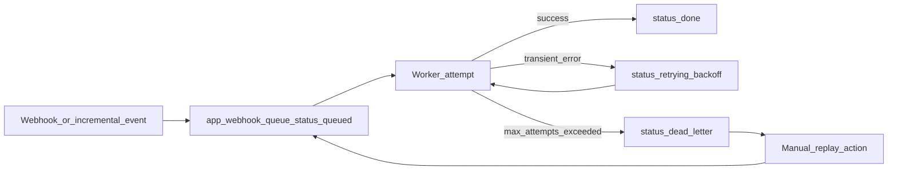

### Incremental History Poll Sequence

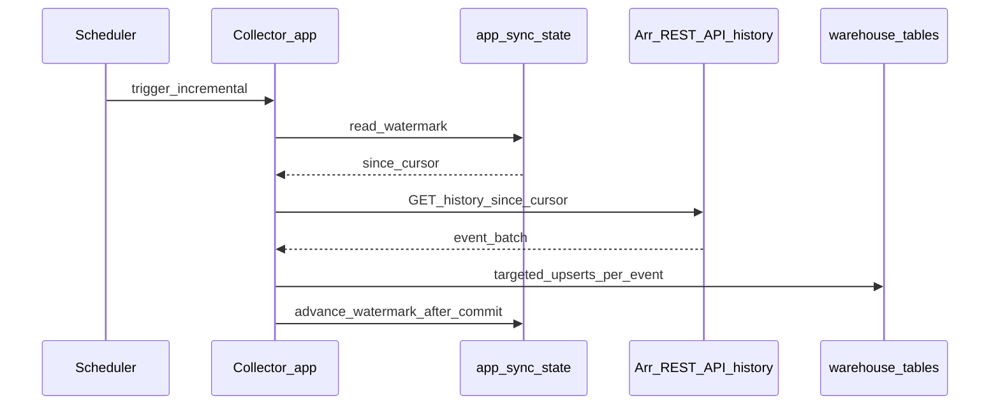

### Full Sync Fan-Out

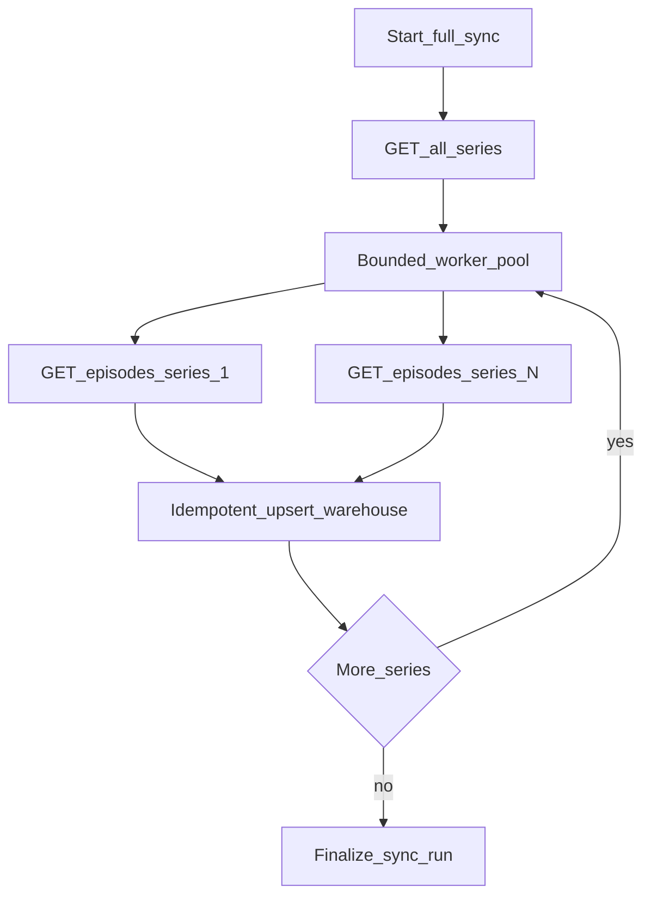

### Capability Probe At Startup

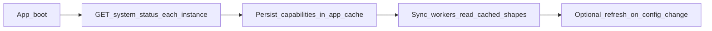

### Graceful Shutdown Sequence

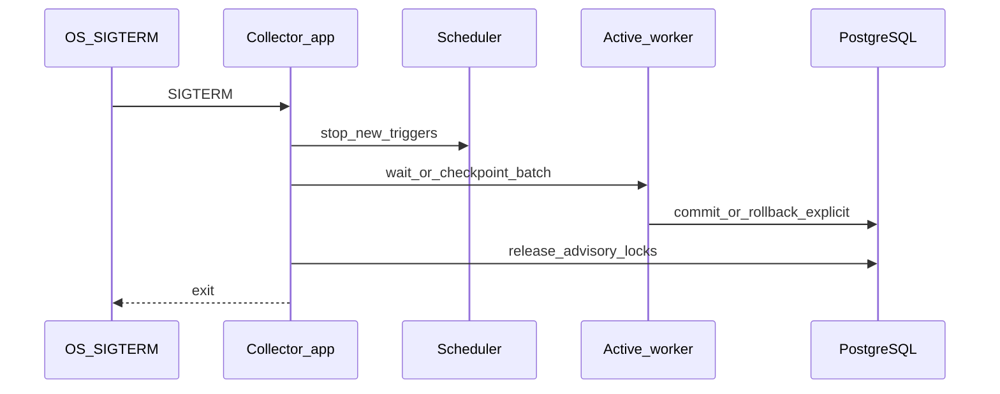

### Delete/Tombstone Propagation

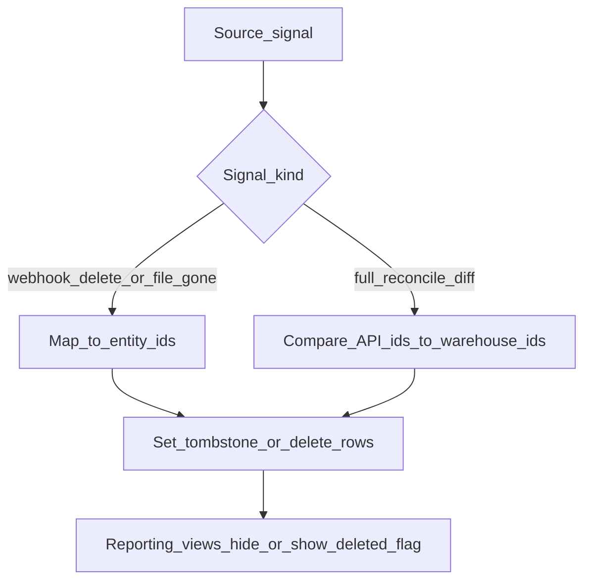

### Lock Strategy Decision Aid

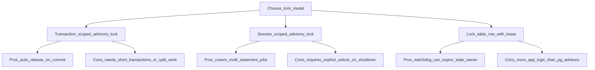

### Trigger Serialization

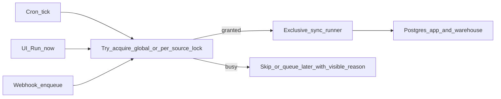

### Webhook Ingress Hardening

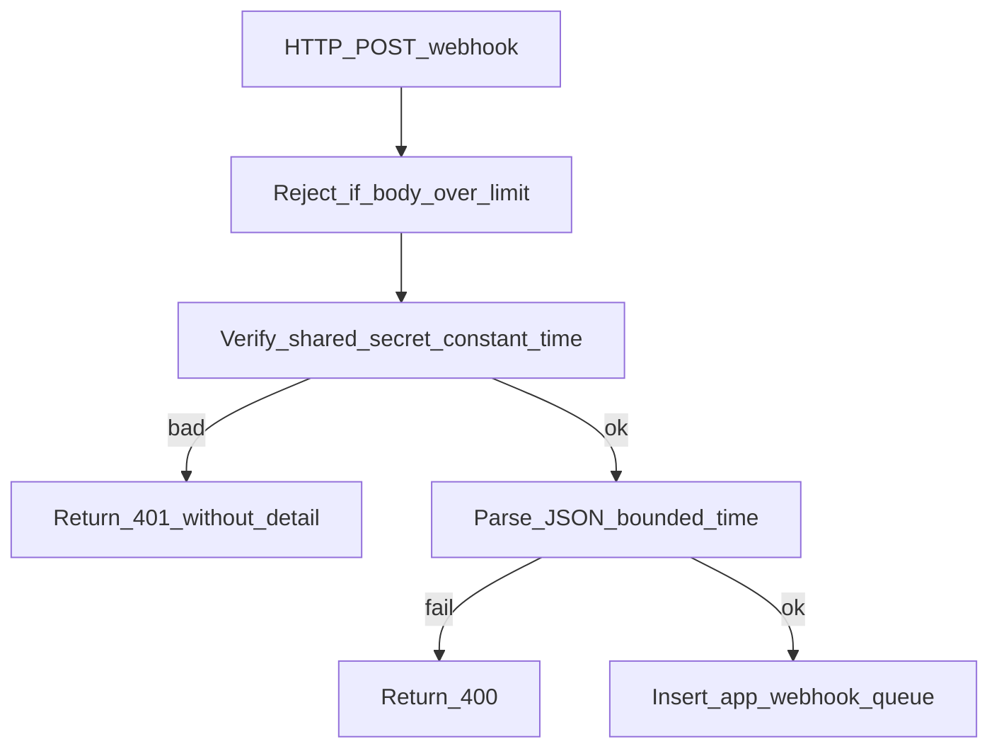

### Existing Repo Architecture Diagram: Runtime

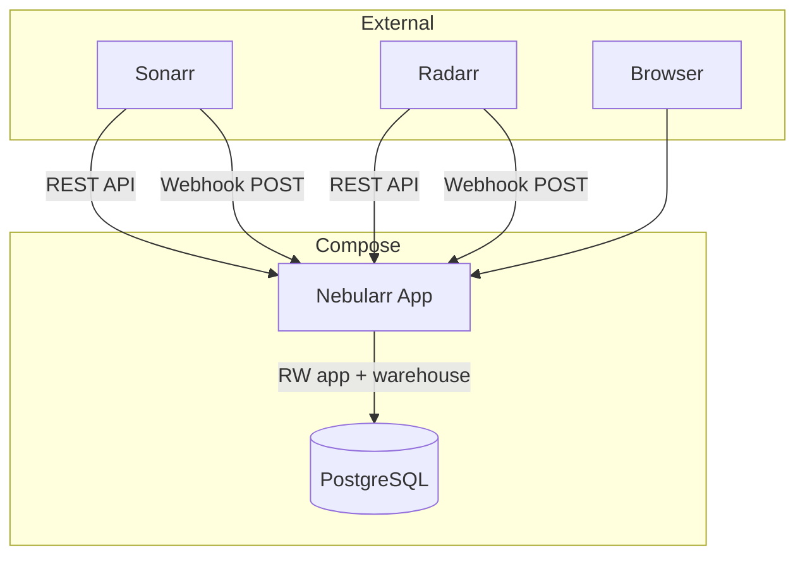

### Existing Repo Architecture Diagram: Sync Modes

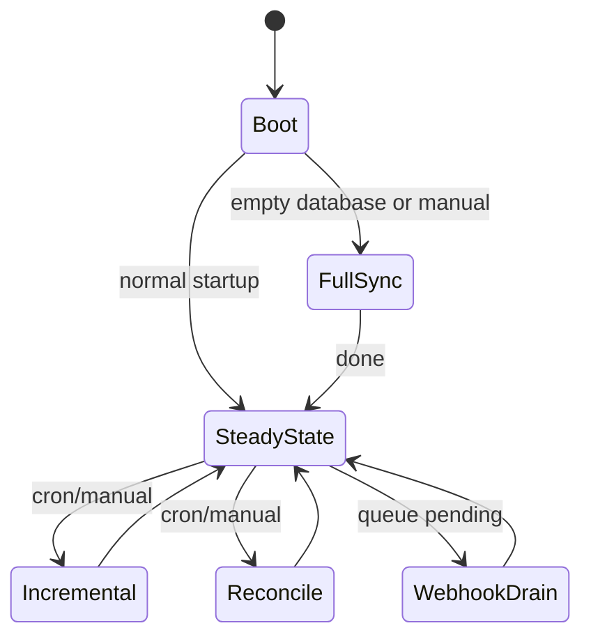

### Existing Repo Architecture Diagram: Locking Model

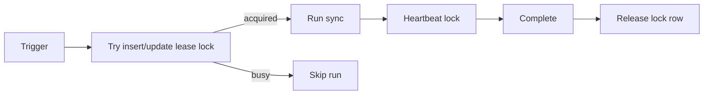

## Backlog (From Original Plan)

- Web UI authentication for non-homelab exposure.
