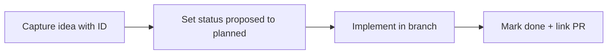

# V2 Backlog And Roadmap

This document tracks post-v1 improvements for the Sonarr/Radarr analytics platform.

## Backlog workflow

## How To Use

- Add items when new opportunities are discovered during implementation, testing, operations, or reviews.
- Keep each item short and outcome-focused.
- Prefer updating status over deleting old ideas.
- Use IDs so items can be referenced in commits and PRs.

## Status Legend

- `proposed`: idea captured, not yet prioritized
- `planned`: selected for v2 planning
- `in_progress`: actively being implemented
- `done`: shipped
- `deferred`: intentionally postponed

## V2 Goals

- Improve reliability under large libraries and noisy webhook traffic.
- Expand operational controls and observability.
- Improve UI scalability and usability.
- Add production-grade security and multi-tenant options.
- Reduce long-term maintenance and upgrade risk.

## Backlog Items

### Reliability And Data Quality

- `v2-rel-001` (`done`, v2.3.0): Integrity audit compares warehouse counts against Sonarr/Radarr API aggregates per instance; on-demand + opt-in `integrity_audit` schedule, `app.integrity_audit_run` history, Sync Operations panel, and drift degrades sync health.
- `v2-rel-002` (`proposed`): Add self-healing watermark repair mode that can rewind to a safe cursor window when incremental gaps are detected.
- `v2-rel-003` (`proposed`): Add exactly-once style event processing option using stronger idempotency keys where upstream event identifiers exist.
- `v2-rel-004` (`proposed`): Add adaptive retry policy with jitter and circuit-breaker behavior per integration.
- `v2-rel-005` (`proposed`): Add queue partitioning by source and priority so webhook spikes do not starve scheduled work.
- `v2-rel-006` (`proposed`): Add configurable archive policy for deleted media entities (retain for N days before hard delete).

### Performance And Scale

- `v2-perf-001` (`proposed`): Add optional materialized summary views with scheduled refresh for heavy reporting dashboards.
- `v2-perf-002` (`proposed`): Add batched upsert paths for high-volume sync runs and tune statement size dynamically.
- `v2-perf-003` (`proposed`): Add API rate tuning profiles (small, medium, large library presets) in UI.
- `v2-perf-004` (`proposed`): Add query budget instrumentation for expensive API and DB operations.
- `v2-perf-005` (`done`, v2.2.0): Reporting tables memoized with a 500-row render cap ("All" page size) and CSV escape hatch; library tables already server-paged. True windowed virtualization deferred.
- `v2-perf-006` (`proposed`): Add benchmark suite with reproducible synthetic datasets and tracked baseline results.

### Security And Access

- `v2-sec-001` (`proposed`): Add Web UI authentication (local users first, then optional OIDC).
- `v2-sec-002` (`proposed`): Add role-based authorization for read-only operator vs admin actions.
- `v2-sec-003` (`proposed`): Add first-class Docker secrets support for API keys and database credentials.
- `v2-sec-004` (`proposed`): Add optional at-rest encryption strategy for sensitive app schema values.
- `v2-sec-005` (`proposed`): Add webhook request nonce/timestamp validation to reduce replay risk.
- `v2-sec-006` (`proposed`): Add security audit logging for config changes and manual sync actions.

### UI And Operator Experience

- `v2-ui-001` (`proposed`): Add dedicated media explorer pages (series, episodes, movies, files) with advanced filters.
- `v2-ui-002` (`done`, v2.2.0): Library/Reporting state now URL-driven with a Saved Views menu and Copy Link.
- `v2-ui-003` (`proposed`): Add dashboard customization (widget visibility, compact mode, refresh intervals).
- `v2-ui-004` (`proposed`): Add CSV/JSON export actions for table datasets.
- `v2-ui-005` (`in_progress`, v2.3.0): Retention policy editing shipped (Schedules → Data retention: run history, storage snapshots, processed queue rows; 0 = keep forever) plus webhook dead-letter requeue/filter controls; queue policy tuning (batch sizes, retry caps) still open.
- `v2-ui-006` (`proposed`): Add guided setup wizard for first-time deployment.
- `v2-ui-007` (`done`, v2.3.0): Dedicated `/mal` page with pipeline runners, overview stats, job history from `app.mal_job_run`, and an unmatched dubbed anime table (new `GET /api/mal/job-runs` and `GET /api/mal/overview`).

### Integrations And Automation

- `v2-int-001` (`proposed`): Add outbound automation hooks for actions like tagging media when quality/language rules match.
- `v2-int-002` (`proposed`): Add pluggable rules engine for policy-based recommendations (example: oversized files with same quality alternatives).
- `v2-int-003` (`done`, v2.2.0/v2.3.0): Discord/Slack-formatted alert webhooks with per-event toggles (health, sync failure, dead-letter) and a test route; email (SMTP) and ntfy channels added in v2.3.0.
- `v2-int-004` (`proposed`): Add optional metadata enrichment from external providers for richer analytics dimensions.
- `v2-int-005` (`proposed`): Add import/export for configuration bundles across environments.

### Platform And Deployment

- `v2-plat-001` (`proposed`): Add Helm chart for Kubernetes deployments while keeping Compose parity.
- `v2-plat-002` (`proposed`): Add zero-downtime upgrade playbook with preflight checks.
- `v2-plat-003` (`proposed`): Add backup verification command that restores into an ephemeral DB and runs checks.
- `v2-plat-004` (`proposed`): Add multi-instance tenancy guardrails and quotas for shared deployments.
- `v2-plat-005` (`proposed`): Add feature-flag framework for staged rollout of risky changes.

### Testing And Developer Workflow

- `v2-test-001` (`proposed`): Add end-to-end test harness with disposable Sonarr/Radarr mocks and PostgreSQL.
- `v2-test-002` (`proposed`): Add migration contract tests to verify backward-compatible view contracts.
- `v2-test-003` (`proposed`): Add load tests for webhook throughput and incremental sync latency.
- `v2-test-004` (`proposed`): Add UI test suite for config forms, filtering behavior, and manual actions.
- `v2-test-005` (`proposed`): Add chaos tests for DB disconnects, Arr timeouts, and worker crashes.
- `v2-sec-001` (`proposed`): If Docker Hub Scout still shows **golang/stdlib** (or other non-runtime) rows after no-attestation builds, investigate **VEX** / **in-toto** / Scout filters or a **slimmer** final stage (e.g. distroless) for operators who need a minimal CVE surface.

## Release Buckets (Draft)

- **v2.0 candidate**: auth, RBAC, UI scalability, stronger queue controls, integrity audits.
- **v2.1 candidate**: rules engine, notifications, materialized summaries, advanced exports.
- **v2.2 candidate**: Kubernetes package, multi-tenant guardrails, deeper automation hooks.

## Notes

- Keep this list intentionally broad early; narrow scope once priorities are agreed.
- When implementing an item, update status and add links to the corresponding PRs/issues.
