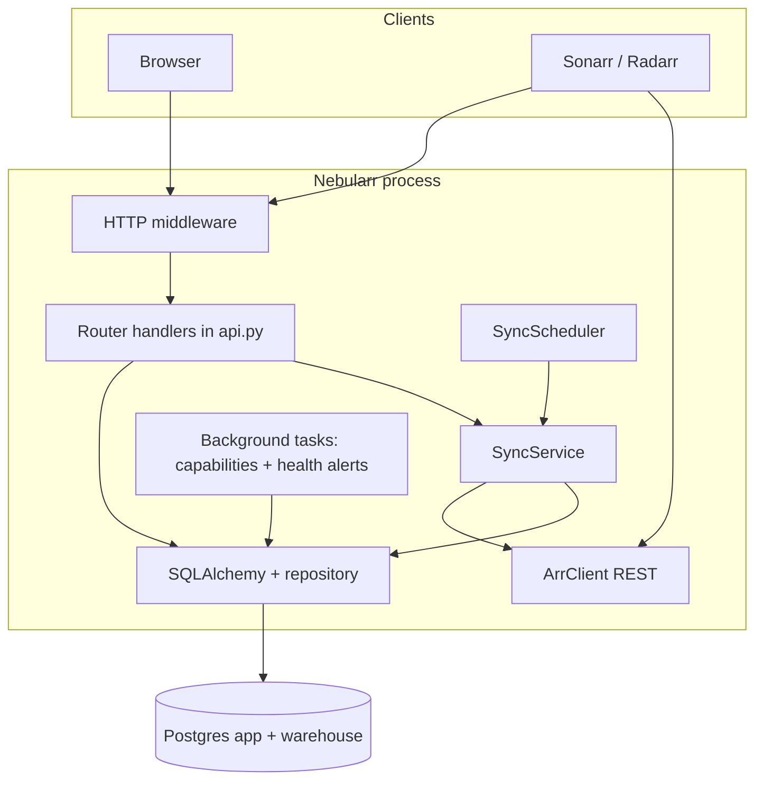
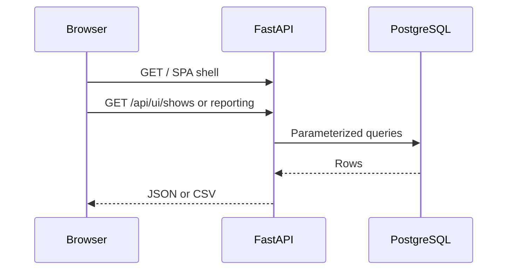
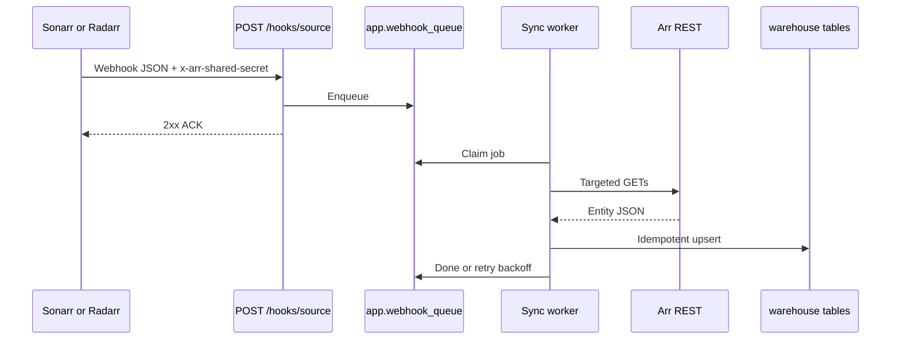
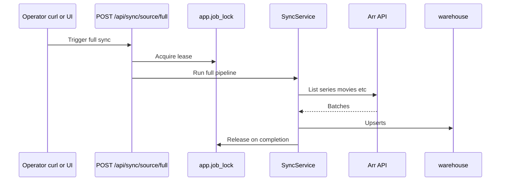

# Nebularr


> **AI-assisted development** — The code, docs, and tooling in this repository were written primarily with AI coding assistants, with human direction and review.

Nebularr is a Docker-first service that ingests Sonarr/Radarr API metadata into PostgreSQL for analytics and the built-in Web UI.

## What it does

- Runs **first full sync** and **incremental sync** (history polling).
- Accepts Sonarr/Radarr **webhooks** and processes a durable queue.
- Stores data in PostgreSQL with two schemas:
  - `app`: config/state/schedules/queue/ops tables.
  - `warehouse`: analytics entities + views (`v_episode_files`, `v_movie_files`, etc.).
- Exposes:
  - `/healthz` with app version and git SHA.
  - `/metrics` (Prometheus text format).
  - Web UI at `/` for operational visibility.

## Architecture and HTTP API

### Low-level architecture (single process)

- **FastAPI** serves the SPA, JSON APIs, Prometheus metrics, and webhook ingress on one port.
- **SQLAlchemy** sessions run short request-scoped transactions; sync jobs use the same pool with longer statement timeouts where configured.
- **SyncService** pulls from Sonarr/Radarr via **ArrClient**, upserts into `warehouse`, and updates `app` state (watermarks, locks, run summaries).
- **SyncScheduler** triggers incremental/reconcile work from cron rows stored in the database (after setup).
- **Webhook path** validates the shared secret, writes to `app.webhook_queue`, and workers process jobs with retries and dead-letter states.
- **Background tasks** (asyncio): Arr capability probe after startup, periodic health evaluation for outbound alert webhooks.



### API surface (quick reference)

| Area | Examples | Role |
| --- | --- | --- |
| Observability | `GET /healthz`, `GET /metrics`, `GET /api/status` | Liveness, Prometheus text, derived health |
| Setup | `GET/POST /api/setup/*` | First-run wizard, skip, initial sync |
| Configuration | `GET/PUT /api/config/integrations/{source}`, `/api/config/webhook`, `/api/config/alert-webhooks`, `/api/config/schedules` | Integrations, webhook verifier, alert targets, cron |
| Sync control | `POST /api/sync/<source>/<mode>` — sources: `sonarr`, `radarr`; modes: `full`, `incremental`, `reconcile` | Manual or scripted runs |
| Webhook ingress | `POST /hooks/sonarr`, `POST /hooks/radarr` | Signed payloads from Arr into the queue |
| Queue admin | `POST /api/webhooks/replay-dead-letter/<source>`, `POST /api/webhooks/requeue/<job_id>` | Recover failed webhook jobs |
| Library UI | `GET /api/ui/*` (shows, episodes, movies, runs, queue, …) | Paged JSON + CSV exports for the SPA |
| Reporting | `GET /api/reporting/dashboards`, `.../{key}`, CSV under panels | Whitelist-only SQL; no ad-hoc SQL from browser |
| Danger zone | `POST /api/admin/reset-data` | Wipe app data (use with care) |

Static assets: `GET /`, `/setup`, `/assets/...`, and the SPA catch-all route for client-side navigation.

### Typical request flows

**Browser → Web UI and JSON APIs**



**Arr → webhook → warehouse**



**Operator → manual full sync**



More diagrams: [`docs/ARCHITECTURE.md`](docs/ARCHITECTURE.md), [`docs/ORIGINAL_PLAN_REFERENCE.md`](docs/ORIGINAL_PLAN_REFERENCE.md).

## Quickstart

### One-click stack (Postgres + App)

```bash
./scripts/one-click-all-in-one.sh
```

Requires an existing **`.env`** (copy from **`.env.example`** first; the script exits with an error if `.env` is missing—see **docs/SECRETS.md**). Then it starts the core stack (app URL and Postgres lines are printed when the script finishes). The script reads **`NEBULARR_BUNDLED_POSTGRES`** (default `true`) and syncs **`COMPOSE_PROFILES`** so bundled Postgres starts unless you opt out.

### Local Docker testing (auto `.env`)

For quick local runs without preparing **`.env`** by hand:

```bash
./scripts/docker-local-up.sh
```

Creates **`.env` from `.env.example` if missing**, then **`docker compose up -d --build`** using **only** your **`.env`** (no `DATABASE_URL=` / `COMPOSE_PROFILES=` shell overrides). Same bundled-postgres profile merge as the one-click script.

### Bundled Postgres vs external

- **Default (local bundled Postgres):** `.env` from `.env.example` sets `NEBULARR_BUNDLED_POSTGRES=true` and `COMPOSE_PROFILES=nebularr-bundled-postgres`, which starts the `postgres` service in `docker-compose.yml`. The Web UI setup can still use host **`postgres`** on port **5432** (the Docker service name on the compose network).
- **External / existing Postgres:** set **`NEBULARR_BUNDLED_POSTGRES=false`** in `.env` and remove **`nebularr-bundled-postgres`** from **`COMPOSE_PROFILES`** (or rely on `./scripts/one-click-all-in-one.sh`, which strips the profile when bundled is false). Then `docker compose up` runs **app only**; in the first setup step, use your real DB hostname, port, database name, and credentials. **`POSTGRES_*` in `.env` only apply to the bundled image** when that service is enabled.

### Core stack (optional bundled Postgres + App)

1. Copy env defaults:

```bash
cp .env.example .env
```

2. Start stack:

```bash
docker compose up --build
```

(`docker compose` loads `.env` from the project directory, including **`COMPOSE_PROFILES`**, so bundled Postgres starts with the defaults above.)

3. Validate app is up:

```bash
./scripts/smoke.sh
```

4. Open the Web UI at `http://localhost:8080`. If you did not set `DATABASE_URL`, the first step collects Postgres host, database name, and credentials (for bundled Postgres, match your `POSTGRES_*`; for external DB, use that server’s host and credentials), waits until Postgres accepts connections, runs Alembic migrations, then continues with integrations, webhook secret, and schedules. Then trigger initial full sync if you have not already:

```bash
curl -X POST "http://localhost:8080/api/sync/sonarr/full"
curl -X POST "http://localhost:8080/api/sync/radarr/full"
```

5. Use **Reporting** and **Library** views in the Web UI; external BI tools can still connect read-only to Postgres and query `warehouse.v_*` views if you grant a suitable role.

## Webhook setup

Configure Sonarr/Radarr webhook target:

- URL: `http://<your-host>:8080/hooks/sonarr` (or `/hooks/radarr`)
- Header: `x-arr-shared-secret: <WEBHOOK_SHARED_SECRET>`

## Scheduler and timezone

- Incremental and reconcile schedules are stored in the database after Web UI setup (see [`docs/SCHEDULER_TIMEZONE.md`](docs/SCHEDULER_TIMEZONE.md)).
- `SCHEDULER_TIMEZONE` and `APP_TIMEZONE` env vars default to `UTC` and act as fallbacks when a schedule row has no timezone.

## Project layout

- `src/arrsync/`: app code, clients, sync logic, scheduler.
- `alembic/`: DB migrations.
- `docker/`: Postgres bootstrap.
- `docs/`: architecture, operations, backup/restore.
  - `ARCHITECTURE.md`, `REPORTING_ARCHITECTURE.md`, `BRANDING.md`, `LOCKING_AND_DLQ.md`, `MIGRATIONS.md`, `POOLING_AND_TIMEOUTS.md`, `ALERTS_AND_SLOS.md`, `DB_BOOTSTRAP.md`, `BACKUP_RESTORE.md`, `OPERATIONS_RUNBOOK.md`, `COMPOSE_RESOURCE_HINTS.md`, `PERF_INDEXING_PLAN.md`, `SCHEDULER_TIMEZONE.md`, `SECRETS.md`, `WEBUI_FRAMEWORK.md`, `WEBUI_AGENT_WORKFLOW.md`, `ORIGINAL_PLAN_REFERENCE.md`, `V2_BACKLOG.md`

## Development

```bash
python3 -m venv .venv
source .venv/bin/activate
pip install -e .[dev]
ruff check src tests
mypy src
pytest -q
```

### WebUI development (React + TypeScript)

```bash
cd frontend
npm install
npm run lint
npm run test
npm run build
```

The frontend build is emitted to `src/arrsync/web/dist` and served by FastAPI. The **root `Dockerfile`** copies that tree into the image (it does not run `npm` in Docker), so run `npm run build` in `frontend/` after WebUI changes before `docker build` / `docker compose build`, or use CI that does the same.

For **Docker Hub** releases, prefer **`./scripts/docker-release-build.sh --push`** (Buildx, **no** SLSA provenance or SBOM attestations) so **Docker Scout** on the registry is less likely to show extra packages from attestation metadata. Plain `docker build` still works for local smoke tests; see the script header for trade-offs.

## WebUI docs

- `docs/WEBUI_FRAMEWORK.md`: frontend architecture, contracts, and local workflows.
- `docs/WEBUI_AGENT_WORKFLOW.md`: task tracker + quality guardian gates and completion criteria.
- `docs/WEBUI_REFERENCE_ASSETS.md`: generated 1:1 page screenshots + sample API/demo data.

## WebUI page references (top-down)

Screenshots are generated from the current React app render and stored in `docs/reference/webui-pages/`.

1. Setup: `docs/reference/webui-pages/setup.png`
2. Home: `docs/reference/webui-pages/home.png`
3. Dashboard: `docs/reference/webui-pages/dashboard.png`
4. Reporting: `docs/reference/webui-pages/reporting.png`
5. Library: `docs/reference/webui-pages/library.png`
6. Sync & Queue (Overview): `docs/reference/webui-pages/sync-overview.png`
7. Sync & Queue (Runs): `docs/reference/webui-pages/sync-runs.png`
8. Sync & Queue (Webhooks): `docs/reference/webui-pages/sync-webhooks.png`
9. Sync & Queue (Manual): `docs/reference/webui-pages/sync-manual.png`
10. Integrations: `docs/reference/webui-pages/integrations.png`
11. Schedules: `docs/reference/webui-pages/schedules.png`
12. Logs: `docs/reference/webui-pages/logs.png`
13. Not Found route: `docs/reference/webui-pages/not-found.png`

## GitHub wiki (optional)

A companion wiki can track how the code and in-repo docs fit together. **Source files** (including a navigation sidebar) live in [`docs/wiki/`](docs/wiki/); [publish them](docs/wiki/README.md) to the GitHub wiki (separate `*.wiki` git repository) or browse them on the default branch. Replace `OWNER/REPO` in the wiki with your org/repo when forking.

CI runs lint/type/tests on push and pull request. An optional Docker smoke job is available via manual workflow dispatch.
