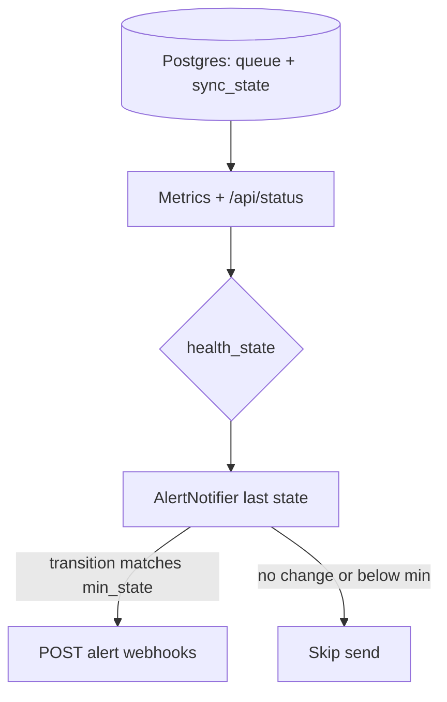
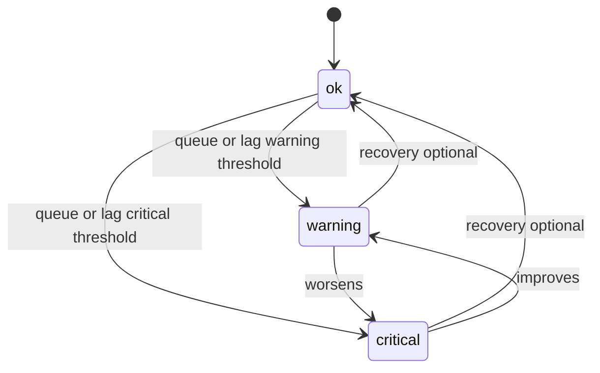

# Alerts and SLO Signals

## Health and alerting workflow

Health is computed from queue depth and sync lag versus env thresholds. Native outbound webhooks fire only on **state transitions** (for example `ok` → `warning`) so operators are not spammed on every poll.

The app exposes `/metrics`.

Suggested alert conditions:

- **Webhook queue depth high**
  - metric: `arrsync_webhook_queue_depth`
  - threshold: > 100 for 10 minutes
- **Sync lag too large**
  - metric: `arrsync_sync_lag_seconds_sonarr`, `arrsync_sync_lag_seconds_radarr`
  - threshold: > 7200 seconds
- **Repeated sync failures**
  - metric: `arrsync_sync_runs_failed_total`
  - alert on steep increase over 15-30 minutes

Operational targets:

- incremental freshness under 30 minutes
- dead-letter queue should trend to zero after replay/recovery
- full reconcile should complete on schedule weekly

Configurable thresholds:

- `ALERT_SYNC_LAG_WARNING_SECONDS`
- `ALERT_SYNC_LAG_CRITICAL_SECONDS`
- `ALERT_WEBHOOK_QUEUE_WARNING`
- `ALERT_WEBHOOK_QUEUE_CRITICAL`
- `ALERT_WEBHOOK_URLS` (comma-separated outgoing webhooks)
- `ALERT_WEBHOOK_TIMEOUT_SECONDS`
- `ALERT_WEBHOOK_MIN_STATE` (`warning` or `critical`)
- `ALERT_WEBHOOK_NOTIFY_RECOVERY`

`GET /api/status` returns derived `health_state` (`ok`/`warning`/`critical`) and `health_reasons`.

When `ALERT_WEBHOOK_URLS` is configured, Nebularr posts chat/webhook alerts on health transitions.
The same alert webhook settings can be managed in WebUI Integrations and are stored in `app.settings` (webhook URLs encrypted when `APP_ENCRYPTION_KEY` is configured).
