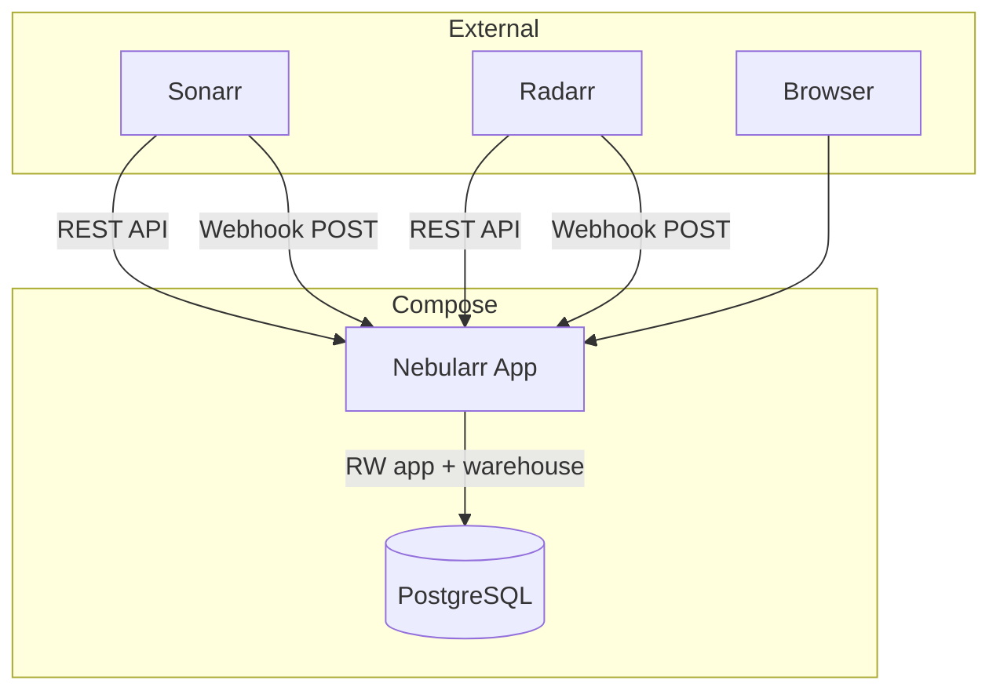
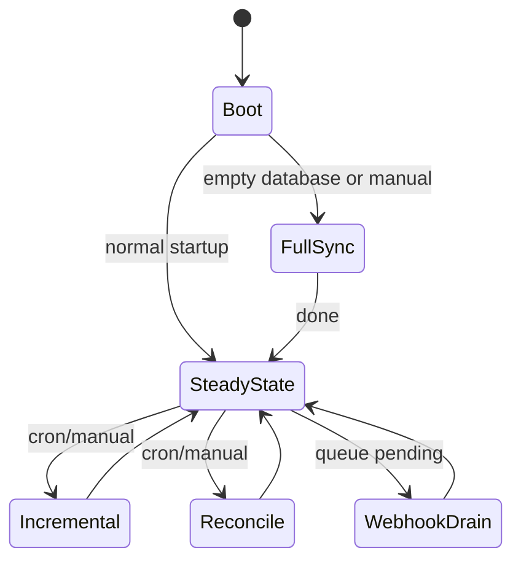
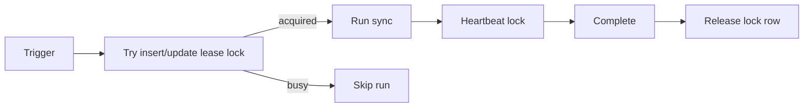

# Architecture

## Runtime

## Sync modes

## Locking model

`app.job_lock` uses a lease (`expires_at`) and owner id. Each sync acquires lock by `source:mode`, heartbeats periodically, then releases on completion. Expired locks can be reclaimed by a later process.

