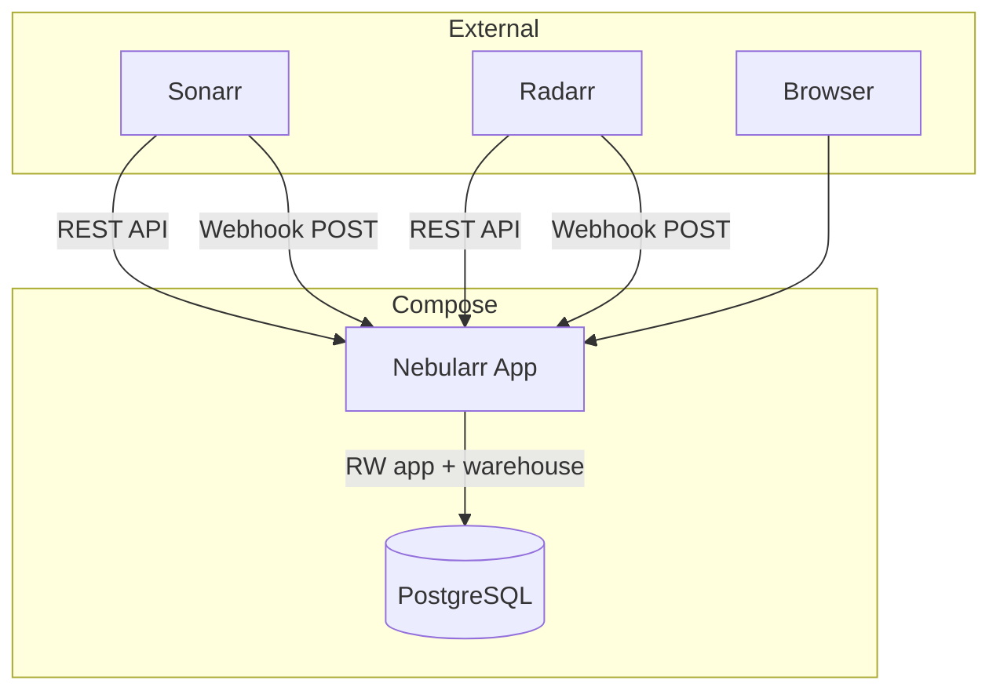
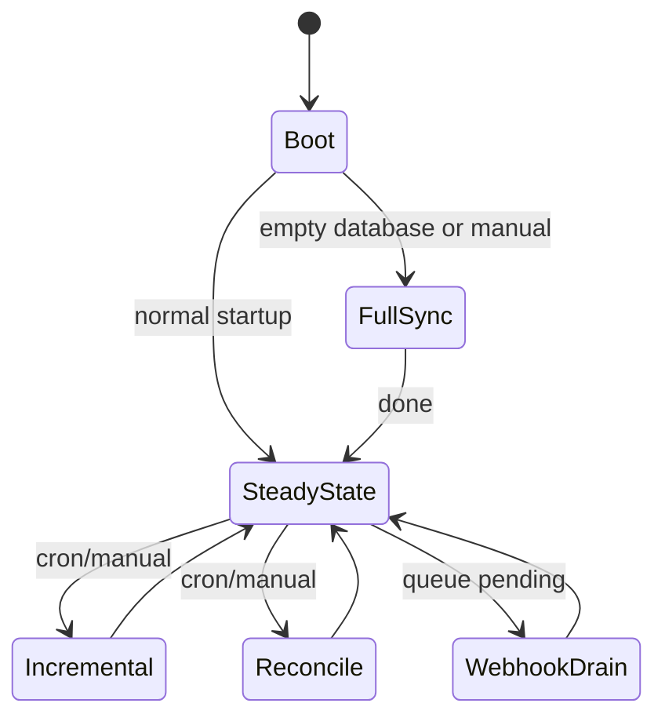
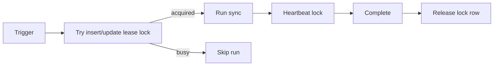

# Architecture

> **Naming:** the distribution/package is `nebularr`; the Python module is `arrsync`
> (a legacy name kept so deployed `uvicorn arrsync.main:app` entrypoints survive upgrades).
> A module rename is planned for a future major release.

## Runtime

## HTTP layer (2.0)

Requests pass through three middlewares in `arrsync.main`, outermost first:

1. **authentication gate** (`arrsync.auth.enforce_auth`) — when auth is enabled, every
   `/api/*` route and the API docs require a session cookie or bearer token; SPA shell
   pages, `/assets/*`, `/healthz`, `/metrics`, and `/hooks/*` (own shared secret) stay open.
2. **database ready gate** — 503s API traffic until first-run setup binds Postgres.
3. **request context** — request-id header + structured access log.

Routes live in `src/arrsync/routers/` (system, auth, reporting, setup, config, sync_ops,
library, mal, operator, hooks, ui_shell) and are composed by `arrsync.api.build_router`;
the ui_shell module registers last because it owns the SPA catch-all route. The route
surface is snapshot-tested (`tests/fixtures/route_table.txt`).

## Sync modes

## Locking model

`app.job_lock` uses a lease (`expires_at`) and owner id. Each sync acquires lock by `source:mode`, heartbeats periodically, then releases on completion. Expired locks can be reclaimed by a later process.

