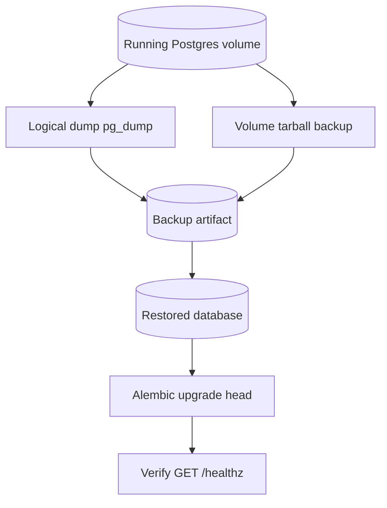

# Backup and Restore

## Backup and restore workflow



## Backup Postgres data volume

Example with compose volume:

```bash
docker run --rm \
  -v sonarr-radarr-data-storage_postgres_data:/var/lib/postgresql/data \
  -v "$PWD:/backup" \
  alpine tar czf /backup/postgres_data_backup.tar.gz -C /var/lib/postgresql/data .
```

For logical backups:

```bash
docker compose exec -T postgres pg_dump -U "${POSTGRES_USER:-arradmin}" "${POSTGRES_DB:-arranalytics}" > backup.sql
```

## Restore

```bash
cat backup.sql | docker compose exec -T postgres psql -U "${POSTGRES_USER:-arradmin}" "${POSTGRES_DB:-arranalytics}"
```

Then run migrations:

```bash
docker compose exec app alembic upgrade head
```

## Migration order

1. Restore DB.
2. Start app with migrations enabled.
3. Verify `/healthz`.

## Post-restore checklist

- Verify app connectivity via `/healthz`.
- Run one manual sync and confirm new rows land in `warehouse.sync_run`.
