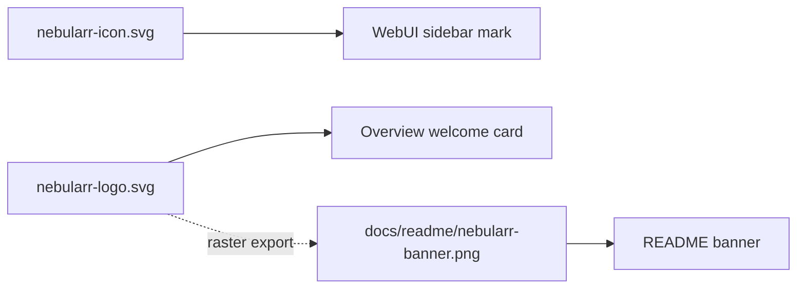
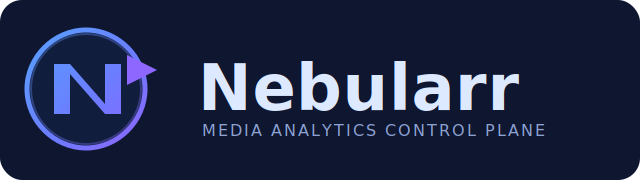

# Branding

## Product Name

- **Nebularr**

## Asset usage map

## Logo

## Brand Intent

- "Nebula" reflects broad media telemetry and discovery.
- "arr" aligns with Sonarr/Radarr ecosystem naming.
- Visual style is dark-theme friendly and matches the app control-plane UI.
