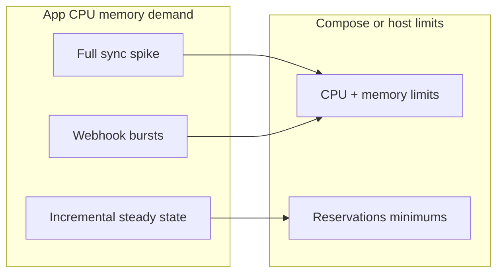

# Compose Resource Hints

For full-sync spikes on larger libraries, consider limits/reservations.

## Workload vs capacity



Example snippet:

```yaml
services:
  app:
    deploy:
      resources:
        limits:
          cpus: "2.0"
          memory: 2G
        reservations:
          cpus: "0.5"
          memory: 512M
```

Notes:

- `deploy.resources` is honored in Swarm; for plain Compose, use host-level constraints or container runtime flags as needed.
- Keep DB memory available for Postgres caches.
