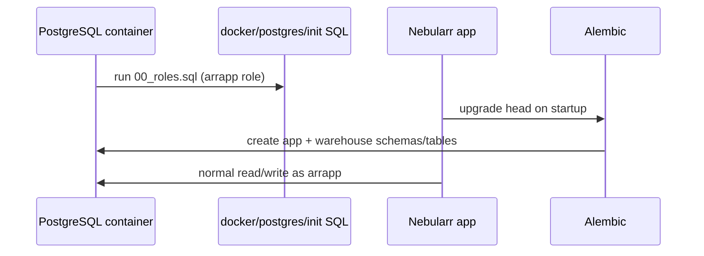

# Database Bootstrap

## First-boot sequence



On fresh startup, the stack creates:

- role (`arrapp`) via `docker/postgres/init/00_roles.sql`
- schemas and tables via Alembic migrations

## First-run permissions

- App uses `arrapp` credentials in `DATABASE_URL`.

## Verification SQL

```sql
\du
\dn
select count(*) from warehouse.sync_run;
```
