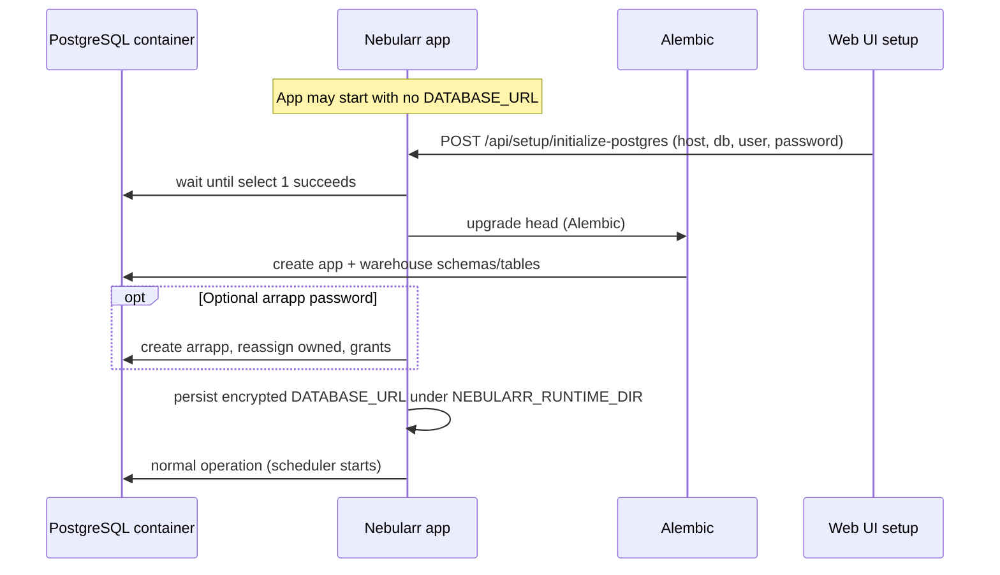

# Database Bootstrap

## First-boot sequence



On a fresh stack:

1. Postgres starts with only `POSTGRES_*` (official image). The app container can start **without** `DATABASE_URL` in the environment.
2. The Web UI setup **PostgreSQL** step calls `POST /api/setup/initialize-postgres`, which waits for the server, runs Alembic migrations, optionally creates `arrapp`, and writes the connection string encrypted to the runtime volume (default `/app/data`).
3. Optional: set `DATABASE_URL` in the environment to skip the wizard step (for automation or operators who prefer env-only).

## Docker Compose: bundled vs external Postgres

Root **`docker-compose.yml`** marks the **`postgres`** service with compose **profile** `nebularr-bundled-postgres`. With **`COMPOSE_PROFILES=nebularr-bundled-postgres`** in `.env` (the default in **`.env.example`**), Compose starts bundled Postgres and the app’s optional **`depends_on`** waits for it. With the profile **omitted** (for example **`NEBULARR_BUNDLED_POSTGRES=false`** and the profile removed, or after **`./scripts/one-click-all-in-one.sh`** strips it), only the **app** container runs; the wizard must target a reachable external Postgres (host is not `postgres` unless you name your external service that on the same network).

## First-run permissions

- If you supply an **arrapp password** in the wizard, the persisted URL uses `arrapp` (recommended).
- If you leave it blank, the superuser URL is persisted (discouraged for production).

## Verification SQL

```sql
\du
\dn
select count(*) from warehouse.sync_run;
```
