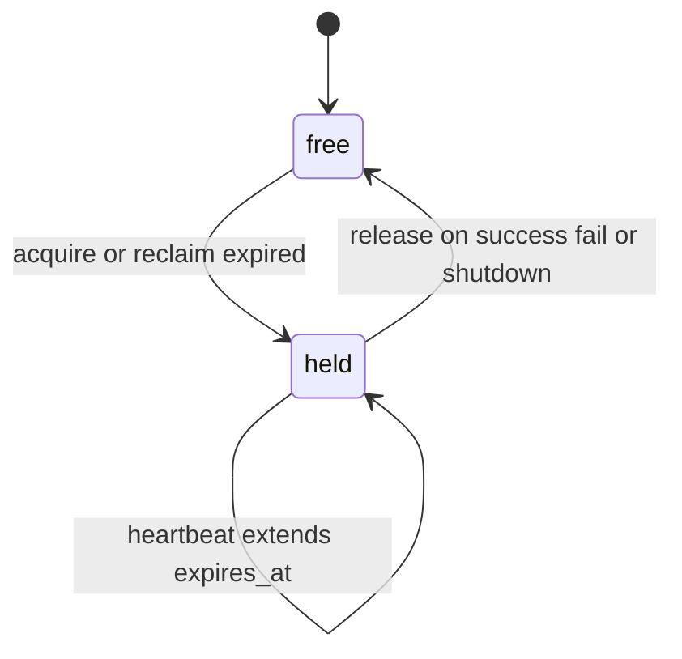
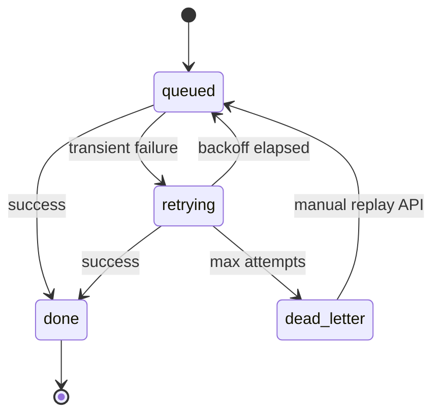

# Locking and DLQ

## Lock lease lifecycle

## Webhook queue states

## Locking

- Lock key: `{source}:{mode}` (for example `sonarr:incremental`).
- Lock table: `app.job_lock`.
- Fields:
  - `lock_name`
  - `owner_id`
  - `acquired_at`
  - `heartbeat_at`
  - `expires_at`

Behavior:

1. Start job -> attempt lock acquire.
2. If lock expired, new job can reclaim it.
3. During long jobs, heartbeat extends lease.
4. On success/failure/stopped run, lock is released.
5. If process crashes, lease expiry allows a later worker to recover lock ownership.

## Webhook retry and dead-letter

- Queue table: `app.webhook_queue`.
- States: `queued`, `retrying`, `done`, `dead_letter`.
- Retry delay backoff: linear to bounded cap.
- Max attempts -> `dead_letter`.
- Replay endpoint:
  - `POST /api/webhooks/replay-dead-letter/sonarr`
  - `POST /api/webhooks/replay-dead-letter/radarr`
