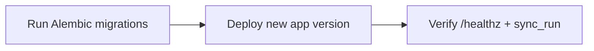
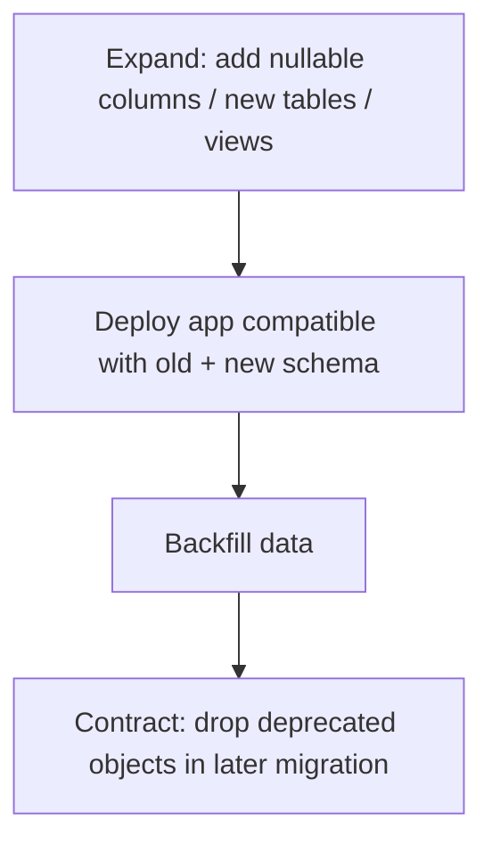

# Migration Strategy (Roll-forward)

Use **roll-forward** migrations only for production-like environments.

## Roll-forward deployment workflow

## Expand / Contract

1. **Expand**:
   - add nullable columns
   - add new tables/views
   - dual-write if needed
2. Deploy app that can read both old/new.
3. Backfill data.
4. **Contract** in a later migration:
   - drop old columns/tables when no longer referenced.

## View contracts

Consumers should read `warehouse.v_*` views, not raw tables. Breaking view changes should:

- use a new view version name, or
- ship coordinated migration + dashboard updates.

## Safe deployment order

1. Run migrations.
2. Start app.
3. Verify `/healthz`.
4. Trigger a manual sync and verify `warehouse.sync_run`.
