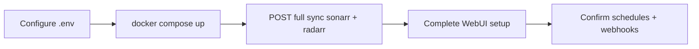
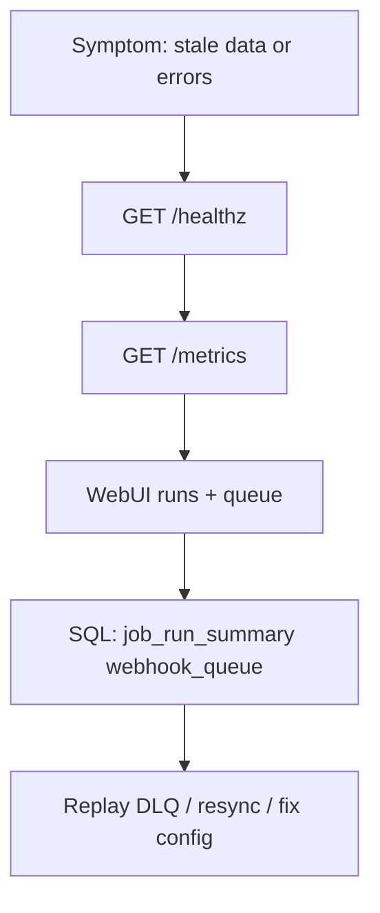

# Operations Runbook

## Operator workflows

### Greenfield bring-up



### Incident triage



## First run

1. Configure `.env`.
2. `docker compose up --build`.
3. Trigger full sync:
   - `POST /api/sync/sonarr/full`
   - `POST /api/sync/radarr/full`

## Normal operation

- Incremental cron runs automatically.
- Reconcile runs on `FULL_RECONCILE_CRON`.
- Webhook queue is processed during incremental ticks.
- Multiple instances are supported via `app.integration_instance` (`source` + `name`).

## Force full sync

Run:

```bash
curl -X POST http://localhost:8080/api/sync/sonarr/full
curl -X POST http://localhost:8080/api/sync/radarr/full
```

## Replay dead letters

```bash
curl -X POST http://localhost:8080/api/webhooks/replay-dead-letter/sonarr
curl -X POST http://localhost:8080/api/webhooks/replay-dead-letter/radarr
```

## Missed webhook recovery

- Use incremental polling and reconcile jobs.
- If needed, run manual full sync.
- Delete events are also reconciled by full/reconcile runs to prevent stale warehouse rows.

## Troubleshooting

- Check `/healthz`.
- Check `/metrics`.
- Check Web UI recent runs and queue state.
- Inspect `app.job_run_summary` and `app.webhook_queue`.

## Graceful shutdown

On SIGTERM:

1. The app marks a shutdown flag so new sync requests are skipped.
2. The scheduler stops accepting new cron triggers.
3. In-flight full/incremental/reconcile loops observe the shutdown flag and stop early at safe boundaries.
4. Sync runs are recorded as `stopped` when interrupted by shutdown.
5. Job locks are released, allowing clean restart recovery.
