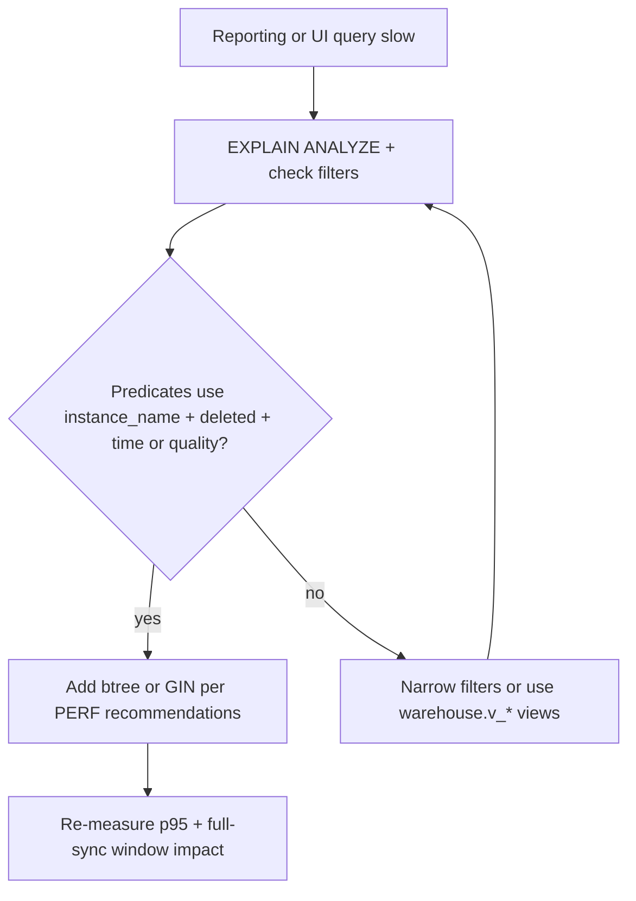

# Performance and Indexing Plan

This document captures the v1 indexing strategy for high-traffic warehouse queries and reporting filters.

## Index decision workflow

## Query patterns to optimize

- Filter by `instance_name`, `source_id`, and `deleted` for entity detail and joins.
- Time-window filters on `air_date`, `seen_at`, and `last_seen_at`.
- File analytics by `quality`, `size_bytes`, and language arrays.
- Operational reads on webhook queue state (`status`, `next_attempt_at`, `received_at`).

## Existing baseline indexes

Current migrations already include:

- PK/unique indexes on warehouse entity keys (`source_id`, `instance_name`).
- Operational queue index: `app.webhook_queue(status, next_attempt_at)`.
- Dedupe unique partial index for `app.webhook_queue(dedupe_key)` when non-null.

## Recommended additions (next migration)

Add these as non-blocking migration steps (concurrently where possible):

- `warehouse.series(instance_name, deleted, title)`
- `warehouse.episode(instance_name, deleted, air_date)`
- `warehouse.movie(instance_name, deleted, year)`
- `warehouse.episode_file(instance_name, deleted, quality, size_bytes)`
- `warehouse.movie_file(instance_name, deleted, quality, size_bytes)`

For language filters used in dashboards:

- GIN index on `warehouse.episode_file(audio_languages)`
- GIN index on `warehouse.movie_file(audio_languages)`
- GIN index on `warehouse.episode_file(subtitle_languages)`
- GIN index on `warehouse.movie_file(subtitle_languages)`

## View and dashboard guidance

- Keep dashboards pointed at stable `warehouse.v_*` views.
- Prefer predicates that include `instance_name` and exclude `deleted = true`.
- Apply time filters early (for example by `air_date`) before expensive aggregations.

## Materialized views (optional)

If dashboard load increases, introduce materialized views for:

- large file outlier aggregations,
- language coverage rollups by quality/profile,
- daily sync throughput and lag summaries.

Refresh strategy:

- incremental refresh cadence every 5-15 minutes,
- full refresh overnight for reconciliation.

## Validation checklist

- `EXPLAIN (ANALYZE, BUFFERS)` for top reporting queries before and after index changes.
- Confirm index selectivity under realistic data volume.
- Track slow query frequency and p95 query latency during full sync windows.
