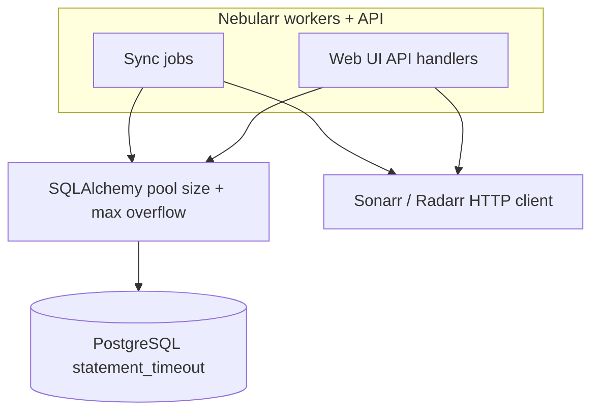

# DB Pooling and Timeouts

This guide documents v1 defaults and tuning strategy for app workers and Web UI queries.

## Connection and timeout layers

## SQLAlchemy and Postgres settings

Key environment settings:

- `SQLALCHEMY_POOL_SIZE`
- `SQLALCHEMY_MAX_OVERFLOW`
- `SQLALCHEMY_POOL_RECYCLE`
- `SQL_STATEMENT_TIMEOUT_MS`

Recommended starting values:

- small homelab: `pool_size=5`, `max_overflow=10`, `pool_recycle=1800`
- medium library: `pool_size=10`, `max_overflow=20`, `pool_recycle=1800`
- statement timeout:
  - app worker default: `120000` ms
  - interactive API/UI queries: keep under `30000` ms target

## Timeout policy by workload

- **Sync workers**
  - allow longer DB statements for batch upserts and reconcile work
  - keep statement timeout bounded to avoid hung workers
- **Web UI/API calls**
  - prefer shorter queries and bounded result sets
  - fail fast on invalid filters rather than expensive broad scans
- **Reporting/API readers**
  - keep dashboard/report queries pointed at `warehouse.v_*` views
  - apply time-range and `instance_name` filters early

## Reporting long-query guidance

- If reporting queries time out:
  - narrow panel time windows,
  - avoid high-cardinality table panels without filters,
  - add indexes from `docs/PERF_INDEXING_PLAN.md`,
  - consider materialized rollups for heavy aggregations.

## HTTP policy toward Sonarr/Radarr

Relevant settings:

- `HTTP_TIMEOUT_SECONDS`
- `HTTP_RETRY_ATTEMPTS`
- `HTTP_MAX_PARALLEL_REQUESTS`

Guidelines:

- Keep parallel requests conservative (2-6 typical).
- Treat 429/5xx as retryable with capped retry budget.
- Avoid unbounded retries and avoid queue amplification during outages.
- Increase timeout slightly for large full-sync runs, but keep bounded to prevent stuck workers.
