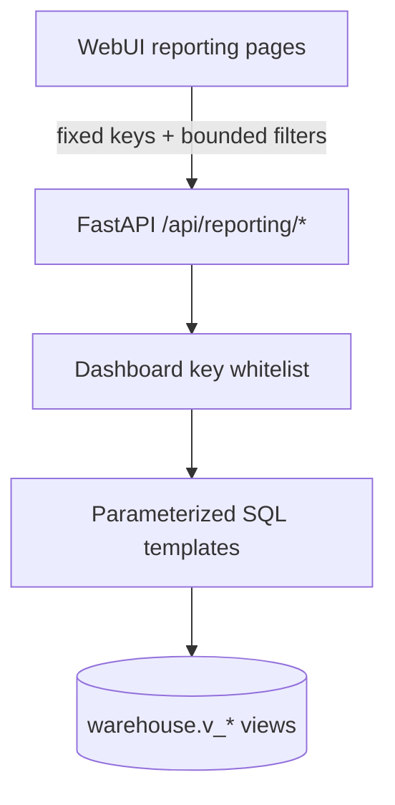
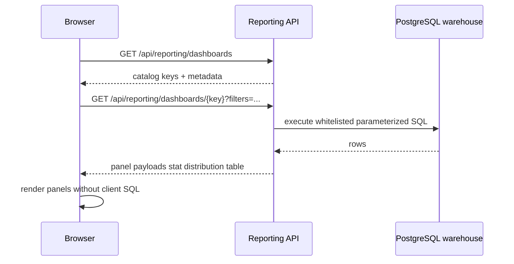

# Nebularr Reporting Architecture

## Goal

Deliver rich analytics directly in Nebularr WebUI while preserving security and operational stability.

## Component design

## Security Model

- Browser calls fixed API endpoints only (`/api/reporting/...`).
- Browser never submits SQL text.
- Backend uses a strict dashboard key whitelist.
- Each dashboard key maps to backend-owned, parameterized SQL templates.
- User input is limited to safe filters (`instance_name`, `limit`) with server-side bounds.
- CSV export is panel-scoped and also whitelist-enforced.

## Runtime Flow

1. UI loads dashboard catalog from `GET /api/reporting/dashboards`.
2. UI requests one dashboard by key from `GET /api/reporting/dashboards/{dashboard_key}`.
3. API executes predefined queries and returns typed panel payloads:
   - `stat`: single KPI
   - `distribution`: `label/value` rows
   - `table`: record rows
4. UI renders panels without any client-side SQL composition.

## Dashboard Porting Strategy

Legacy dashboard definitions are ported incrementally into backend report handlers:

- `overview` -> portfolio KPIs, quality distributions, largest files
- `sonarr-forensics` -> episode distributions + missing file analysis
- `radarr-forensics` -> movie distributions + storage analysis

Additional dashboards (ops, language audit, deep dive, sync ops) can be added by extending the same whitelist map.

## Panel registry (`reporting_registry.py`)

Every dashboard row panel (table / distribution / timeseries) whose body is a
single SQL query is authored once as a `PanelSpec` in
`src/arrsync/routers/reporting_registry.py`, not duplicated per handler:

- `PanelSpec.build(params) -> (sql, binds)` is the single source of truth for
  a panel's SQL; `params` carries the normalized `instance_name` and clamped
  `limit`. Dashboard GET handlers assemble panels through `rows_panel()`; the
  KPI stat cards (byte-formatted or otherwise Python-computed) stay inline in
  the handlers.
- A shared **episode-inventory CTE** (`EPISODE_INVENTORY_CTE`) joins
  `episode ⋈ series ⟕ episode_file` once, with `has_file` and coalesced
  audio/subtitle language arrays computed a single time. Panels across
  `sonarr-forensics`, `language-audit`, `media-deep-dive`,
  `monitoring-audit`, and `english-dub-coverage` select from it instead of
  re-deriving the join (and its `hasFile`/language-null edge cases)
  independently — this is what fixed the missing-English-audio stat/table
  disagreement and the no-file-double-counting in the audit panels.
  A handful of panels intentionally stay off the CTE (documented inline)
  where its left join would change row cardinality for that specific query.
- Near-identical distribution panels (quality/codec/language mixes) are
  generated by `distribution_by_view()`, `language_unnest_by_view()`,
  `codec_union_mix()`, and `language_union_mix()` rather than copy-pasted per
  dashboard.
- The **CSV export executes exactly one panel's query** via `build_rows()`,
  looking the panel up by its `dashboard:panel_id` key in the `PANELS`
  registry — it no longer runs the whole dashboard to produce a single
  panel's CSV.

## Why this architecture

- Prevents SQL injection and accidental expensive ad-hoc queries from the browser.
- Keeps query compatibility under Nebularr backend control.
- Allows consistent pagination/limits and stable API contracts.
- Supports drilldown actions and CSV export in one UI.
