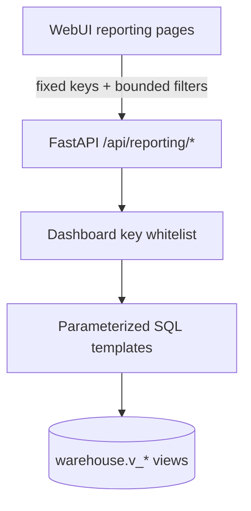
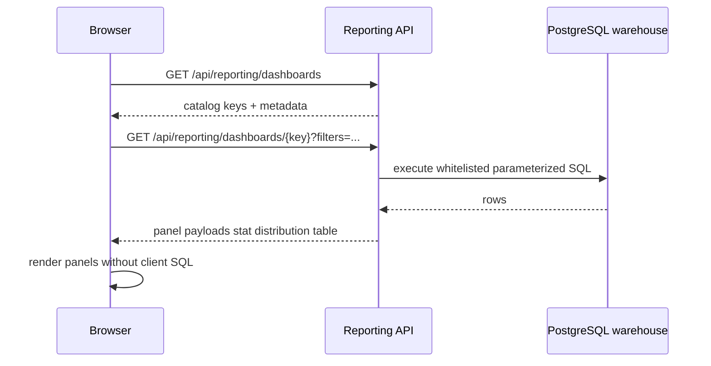

# Nebularr Reporting Architecture

## Goal

Deliver rich analytics directly in Nebularr WebUI while preserving security and operational stability.

## Component design

## Security Model

- Browser calls fixed API endpoints only (`/api/reporting/...`).
- Browser never submits SQL text.
- Backend uses a strict dashboard key whitelist.
- Each dashboard key maps to backend-owned, parameterized SQL templates.
- User input is limited to safe filters (`instance_name`, `limit`) with server-side bounds.
- CSV export is panel-scoped and also whitelist-enforced.

## Runtime Flow

1. UI loads dashboard catalog from `GET /api/reporting/dashboards`.
2. UI requests one dashboard by key from `GET /api/reporting/dashboards/{dashboard_key}`.
3. API executes predefined queries and returns typed panel payloads:
   - `stat`: single KPI
   - `distribution`: `label/value` rows
   - `table`: record rows
4. UI renders panels without any client-side SQL composition.

## Dashboard Porting Strategy

Legacy dashboard definitions are ported incrementally into backend report handlers:

- `overview` -> portfolio KPIs, quality distributions, largest files
- `sonarr-forensics` -> episode distributions + missing file analysis
- `radarr-forensics` -> movie distributions + storage analysis

Additional dashboards (ops, language audit, deep dive, sync ops) can be added by extending the same whitelist map.

## Why this architecture

- Prevents SQL injection and accidental expensive ad-hoc queries from the browser.
- Keeps query compatibility under Nebularr backend control.
- Allows consistent pagination/limits and stable API contracts.
- Supports drilldown actions and CSV export in one UI.
