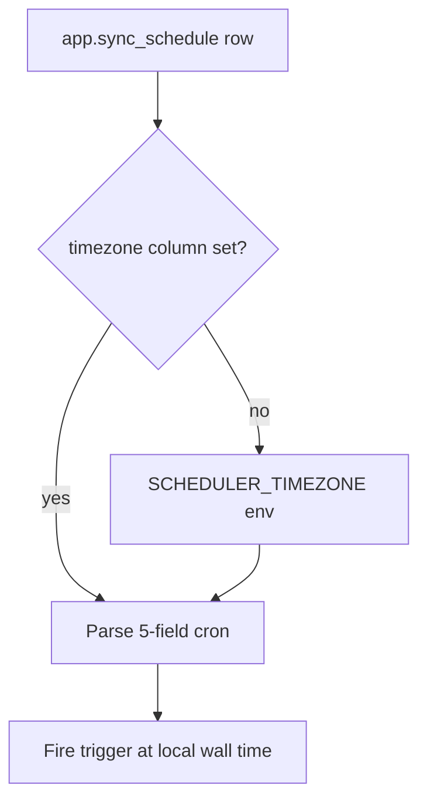

# Scheduler Timezone Semantics

This app uses cron expressions for incremental and reconcile schedules.

## Cron resolution workflow

## Defaults

- `SCHEDULER_TIMEZONE=UTC`
- `APP_TIMEZONE=UTC`

## How cron is interpreted

- `app.sync_schedule.cron` values are parsed with `app.sync_schedule.timezone`.
- If no per-row override is used, scheduler falls back to `SCHEDULER_TIMEZONE`.
- Cron strings use standard 5-field crontab format (`min hour day month dow`).

## Recommendation

- Keep scheduler timezone in UTC for predictable operations.
- Convert display time in dashboards/UI for human readability.
- When using local timezones, account for daylight-saving transitions.

## Related canonical time behavior

- Warehouse timestamps are persisted in UTC-compatible forms.
- For Sonarr episodes, `airDateUtc` is preferred; `airDate` is fallback.
