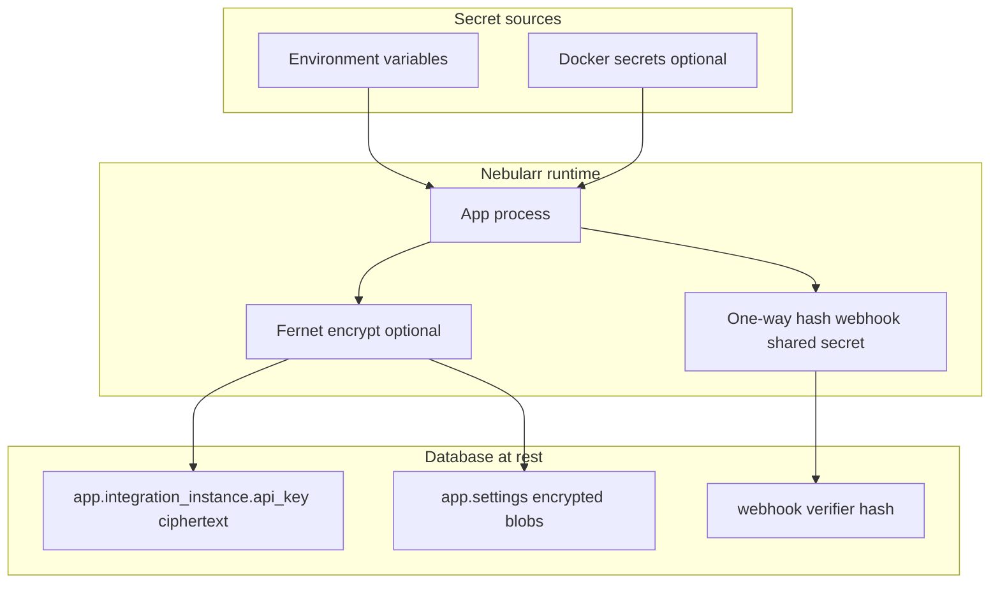

# Secrets Handling

This project is designed to avoid hardcoding secrets and to minimize accidental exposure.

## Secret flow and storage design

## Preferred secret sources

Use environment variables or Docker secrets for:

- Sonarr API key
- Radarr API key
- Webhook shared secret
- PostgreSQL passwords (`POSTGRES_PASSWORD`, `DATABASE_URL`)

## Logging policy

- Do not log raw webhook payloads at info level.
- Do not log API keys, DB passwords, or webhook secrets.
- Structured logs should include operational metadata (for example `sync_run_id`, request id), not credentials.

## Storage notes

- App integration keys are stored in `app.integration_instance.api_key` for runtime operation.
- Restrict DB access and backups accordingly.
- If you require stronger controls, use encrypted storage at rest (for example encrypted volume / disk layer, or database-level encryption tooling in your environment).

## Operational recommendations

- Rotate API keys and shared secrets periodically.
- Keep `.env` out of version control.
