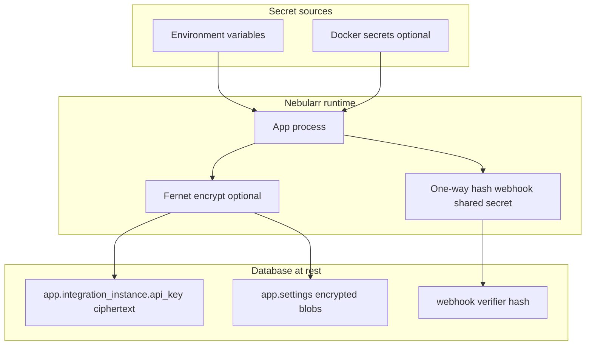

# Secrets Handling

This project is designed to avoid hardcoding secrets and to minimize accidental exposure.

## Secret flow and storage design

## `.env` and the Docker image

- **The app image does not include your `.env` file.** `.dockerignore` excludes `.env` (and `.env.*` except `.env.example`) from the build context, and the `Dockerfile` never copies `.env` into the runtime image.
- **Compose on the host** still reads the project `.env` for variable substitution (for example `POSTGRES_PASSWORD`, `COMPOSE_PROFILES`). That file lives on the operator machine, not inside the `app` container.
- **Inside the container**, configuration comes from the `environment:` block Compose passes into the process. The app sets `NEBULARR_ENV_FROM_PROCESS_ONLY=true` there so settings load from the process environment only (no `.env` file is expected or required in `/app`).
- **Local `uvicorn` / CLI runs** from the repository root **require** a `.env` file unless you are in CI/tests/Docker or set `NEBULARR_ALLOW_NO_DOTENV=true`. If `.env` is missing, startup raises an error pointing here and to the README Quickstart.

## Preferred secret sources

Use environment variables or Docker secrets for:

- Sonarr API key
- Radarr API key
- Webhook shared secret
- PostgreSQL superuser (`POSTGRES_PASSWORD`, first-boot `DATABASE_URL`); after Web UI database setup, the `arrapp` URL is stored encrypted on the app runtime volume (`NEBULARR_RUNTIME_DIR`, default `/app/data`) instead of living only in environment variables

## Logging policy

- Do not log raw webhook payloads at info level.
- Do not log API keys, DB passwords, or webhook secrets.
- Structured logs should include operational metadata (for example `sync_run_id`, request id), not credentials.

## Storage notes

- App integration keys are stored in `app.integration_instance.api_key` for runtime operation.
- Restrict DB access and backups accordingly.
- If you require stronger controls, use encrypted storage at rest (for example encrypted volume / disk layer, or database-level encryption tooling in your environment).

## Operational recommendations

- Rotate API keys and shared secrets periodically.
- Keep `.env` out of version control.
