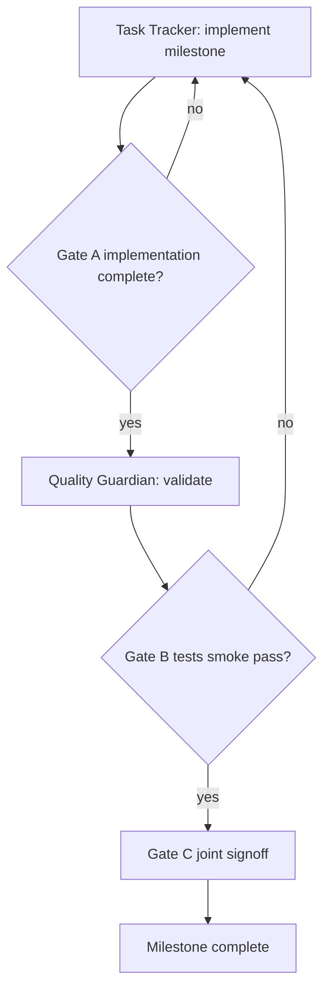

# Nebularr WebUI Multi-Agent Workflow

This document defines how two coordinated agents execute the WebUI rebuild safely.

## Dual-agent gate workflow

## Agent 1: Task Tracker

Responsibilities:

- Drive todo order from the approved WebUI plan.
- Mark tasks through states (`pending` -> `in_progress` -> `completed`).
- Attach short evidence notes for each completed milestone:
  - changed files
  - tests run
  - validation outcomes

## Agent 2: Quality Guardian

Responsibilities:

- Validate every major milestone before completion.
- Run regression checks for:
  - API contract compatibility
  - library pagination/sort/filter behavior
  - sync operations and progress surfaces
  - integration and schedule save flows
  - Docker startup and health checks
- Block milestone signoff until failures are addressed.

## Handoff Gates

Every major milestone must pass the same gate sequence:

1. **Gate A - Implementation Complete**
   - Tracker confirms scope is implemented.
2. **Gate B - Validation Pass**
   - Guardian confirms tests/smoke checks pass.
3. **Gate C - Joint Signoff**
   - Milestone can be marked complete only when Gate A and Gate B pass.

## Required Validation Matrix

- Frontend lint + unit tests.
- Backend tests including API contract tests.
- Optional E2E critical flow checks.
- Python lint/type checks (`ruff`, `mypy`) for backend changes.
- Docker smoke where affected by build/runtime changes.

## End-of-Plan Completion Rule

The plan is complete only if:

- all todos are completed by Task Tracker,
- Quality Guardian signs off final regression pass,
- WebUI and backend are both functional in the integrated stack.
