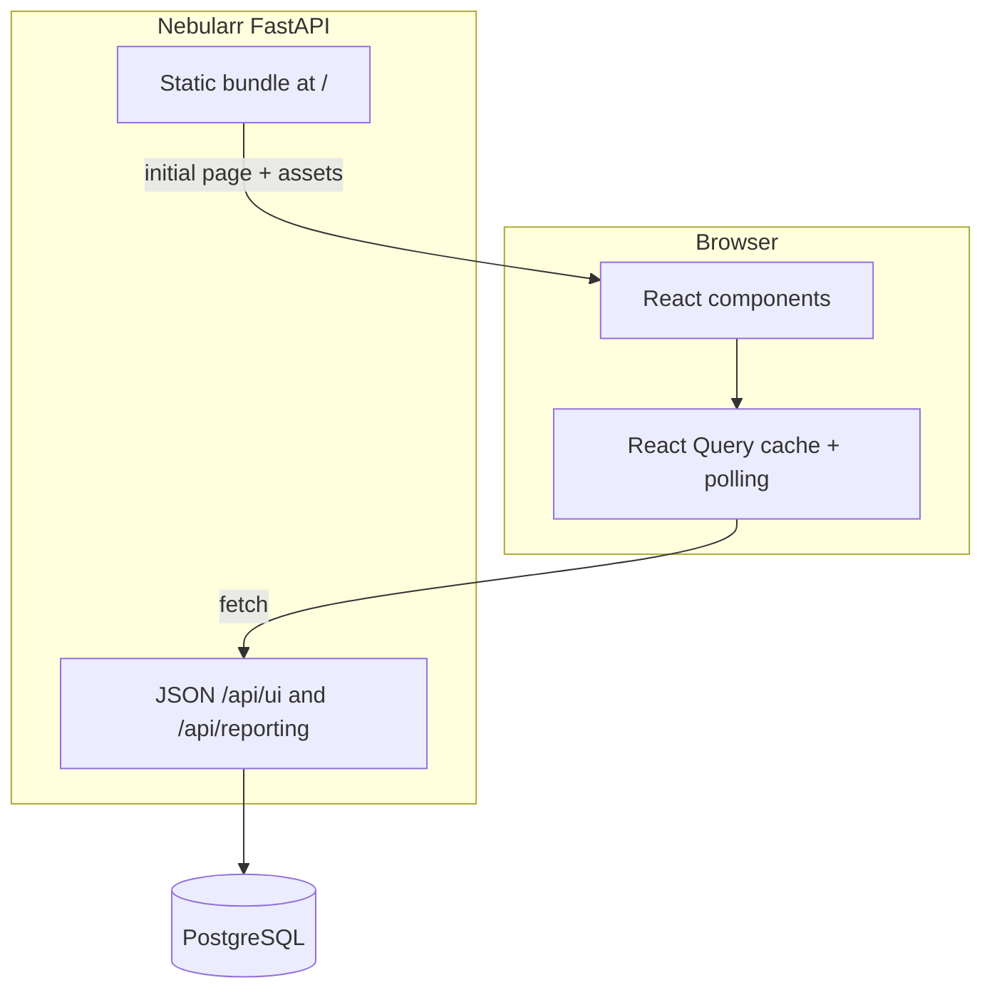

# Nebularr WebUI Framework Guide

## Layered design



## Stack

- Framework: React + TypeScript + Vite (`frontend/`).
- Data layer: `@tanstack/react-query` with polling + cache invalidation.
- Table UX: server-side pagination/sort/filter via FastAPI contracts.
- Build output: `src/arrsync/web/dist` (served by FastAPI at `/`).

## Local Development

```bash
cd frontend
npm install
npm run lint
npm run test
npm run build
```

Run backend and frontend together with Docker:

```bash
docker compose up --build
```

## API Contracts for Large Library Views

The heavy WebUI routes now support paged contracts:

- `GET /api/ui/shows`
- `GET /api/ui/shows/{series_id}/episodes`
- `GET /api/ui/episodes`
- `GET /api/ui/movies`

Query params:

- `limit`
- `offset`
- `sort_by`
- `sort_dir`
- `paged=true` (returns envelope response)

Envelope shape:

```json
{
  "items": [],
  "total": 0,
  "limit": 50,
  "offset": 0,
  "has_more": false
}
```

## CSV Exports

CSV endpoints support sort params and `export_all=true`:

- `/api/ui/shows/{series_id}/episodes/export.csv`
- `/api/ui/episodes/export.csv`
- `/api/ui/movies/export.csv`

## Advanced UX Capabilities Implemented

- Saved state for current view and library filters (local storage).
- Command palette (`Ctrl/Cmd + K`) for quick actions.
- Keyboard shortcuts (`/` focuses library search, quick nav keybinds).
- Compare mode for episode-level side-by-side checks.
- Detail drawer for row payload drilldown.
- Structured diagnostics panel for API and action failures.
